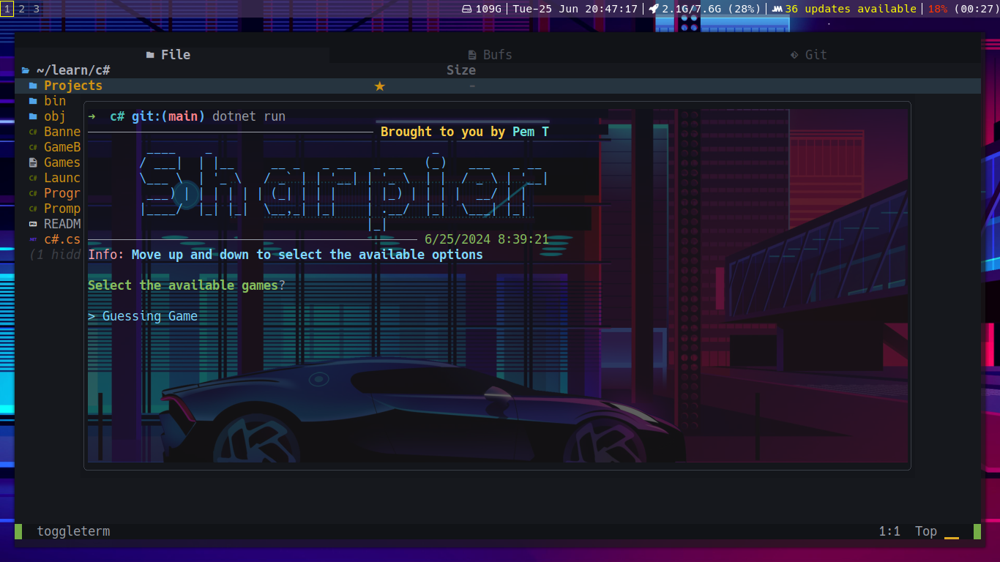

# Sharpier Projects 
> What I cannot create, I do not understand _- Richard Feynman_

**The projects I will built while making myself to learn C#**



### Projects built

- [x] Guess the programming language
- [ ] Calculator (Progress)

### Concepts Learnt

- Datastructures
  - Dictionary

### Requirements

- Dotnet SDK 8.0.0

### How to Run it

```bash
# Clone the repository
git clone https://github.com/pemtshewang/Sharpier-Projects.git

# Enter the directory
cd Sharpier-Projects

# Just run
dotnet run
```

### Happy words

- Pull Requests are welcomed and make your contributions here!
  Happy Hacking :)
